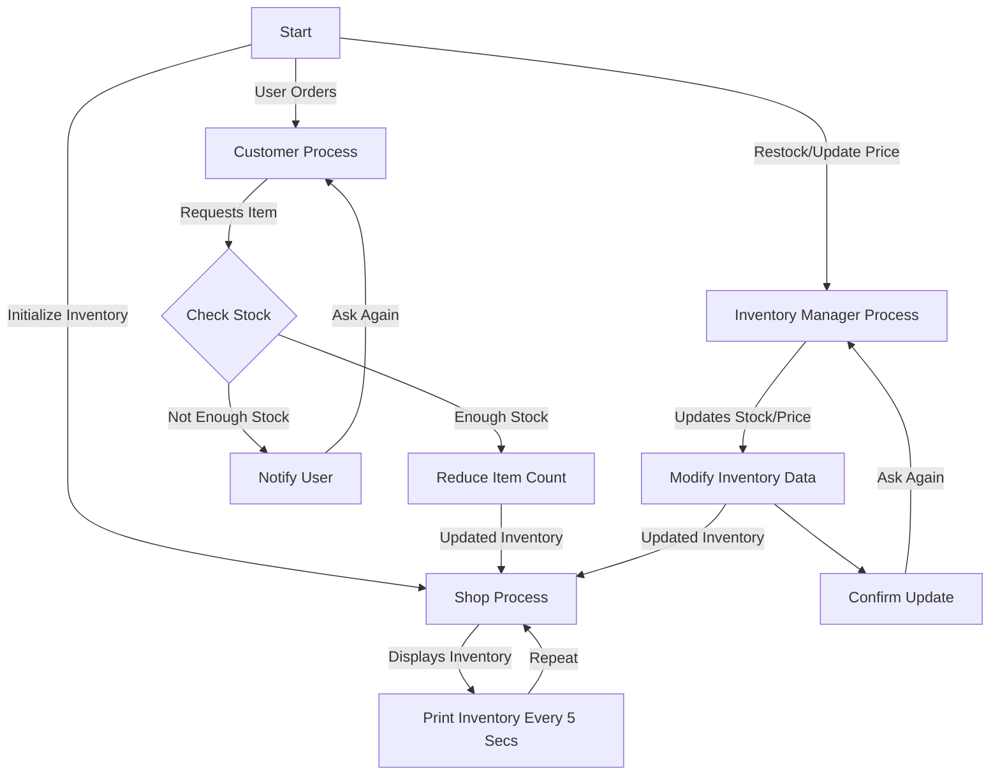

# Clothing Shop Simulation

## Overview
This project is a multi-process simulation of a clothing shop using **Inter-Process Communication (IPC)** mechanisms. It consists of three main components:

1. **Shop Process**: Manages the shop's inventory, periodically prints stock and prices, and processes customer orders.
2. **Customer Process**: Allows users to place orders, which are sent to the Shop Process.
3. **Inventory Manager**: Enables inventory restocking and price modifications.

IPC mechanisms used:
- **Message Queues** (for order placement)
- **Shared Memory** (for inventory management)
- **Semaphores** (for synchronization)

## Flowchart



## How to Compile and Run
### **1. Compile the Program**
```bash
gcc -o clothes_shop *.c
```

### **2. Run the Program**
```bash
./clothes_shop
```

## Expected Behavior
- The **Shop Process** continuously prints inventory updates.
- The **Customer Process** allows users to place orders, which are processed if stock is available.
- The **Inventory Manager** enables restocking items and modifying prices.
- IPC ensures smooth communication between processes.

## License
This project is open-source and can be modified as needed.

